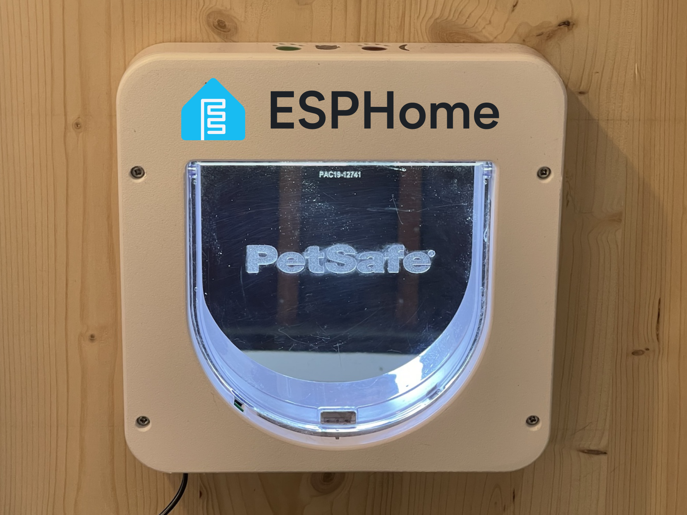
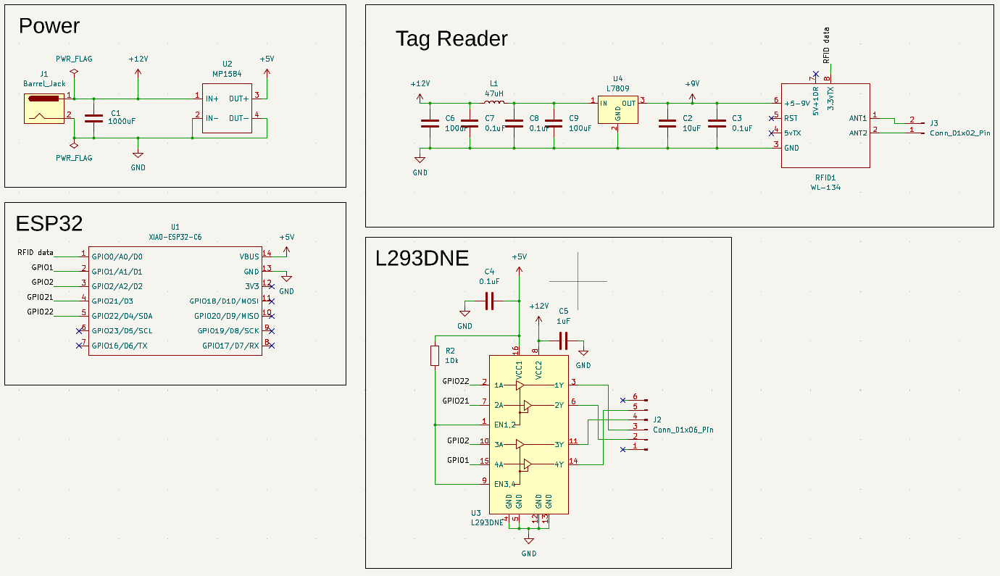
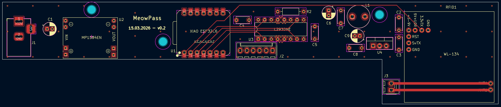
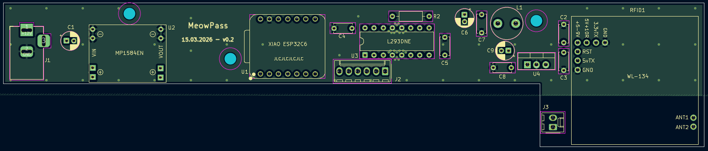
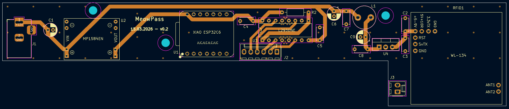
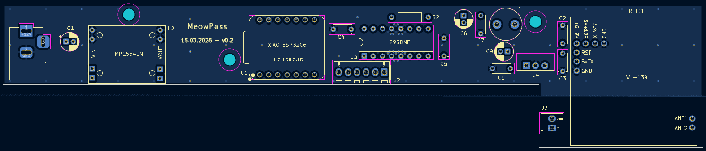
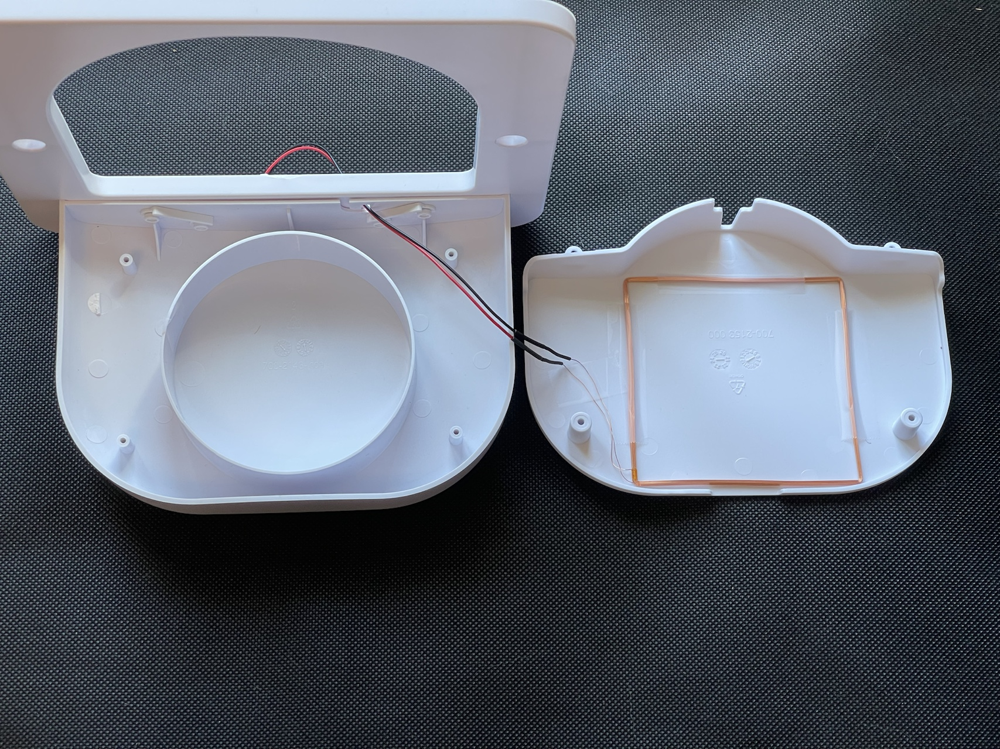
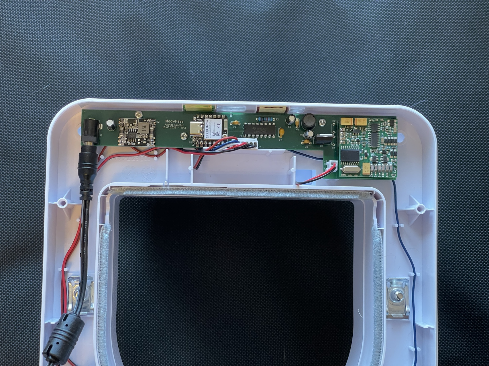
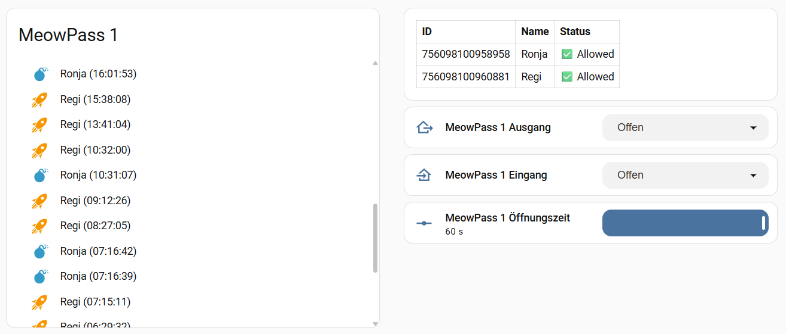

# MeowPass
**The ESP32-powered brain transplant for your PetSafe PetPorte.**

MeowPass is an open-source hardware and software replacement for the PetSafe PetPorte cat flap. By swapping the original PCB for a custom ESP32-C6 board running ESPHome, you gain full control via Home Assistant, easier cat management, and better reliability.



## Introduction
In the original Petporte cats can only be added by scanning them within 30 seconds of pressing a button. With a shy cat this can be difficult. 

I wanted to add a very shy cat to my cat flap, so I decided to create an ESPHome version and build MeowPass.

## Features
* Add cats by entering chip number + name in Home Assistant
* Track cats going through the cat flap
* Open / close the cat flap remotely
* See if any strange cats want to enter your home

## PCB Design
The custom PCB was designed in KiCad 9.0 to fit within the PetPorte chassis while accommodating the larger WL-134 module.

There are 3 different power levels: 
* 12V from the power supply, and to operate the solenoids
* 9V for the WL-134, this power needs to be as clean as possible to ensure maximum reading distance.
* 5V for the ESP32



The PCB was built with 4 layers: Signal - Gruond - Power - Ground

Layer 1, Signal:
Layer 2, Ground:
Layer 3, Power:
Layer 4, Ground:

This gives enough space to use wide power traces, and the ground planes don't need to be interrupted by signal or power traces. 

## Bill of Materials
* **Main Parts**
    * Seeed Studio XIAO ESP32C6
    * WL-134 RFID Reader
    * L293DNE Motor driver
    * MP1584EN 5V DC-DC Buck Converter
    * L7809CV Voltage Regulator 9V
* **Passives**
    * 3 x 100uF 25V Capacitor
    * 1 x 10uF Ceramic Capacitor
    * 1 x 1uF Ceramic Capacitor
    * 4 x 0.1uF Ceramic Capacitor
    * 1 x 47uH Inductor
    * 1 x 10kOhm Resistor
* **Connectors**
    * DC Power Jack Socket
    * KF2510 6-pin male connector
    * KF2510 2-pin male connector
<!-- TODO Photo of assembled print -->

A high quality 12V DC power supply is really important. I tested a cheaper power supply, and even with all the filtering this reduces the reading distance by a lot. For that reason i used a **MeanWell GST36E12-P1J**.

In total, I paid around 6$ per PCB, 14$ for the power supply and 32$ for all the other components, which gives a total of 52$ for the complete print. Additionally, the PetSafe Petporte costs around 120$ to 180$.

## Assembly instructions
The WL-134 needs an antenna with an inductance of around 500 uH to 600 uH. Even with the additional tuning capacitors the inductance of the existing antenna is too far off and doesn't work well with the WL-134. Fortunately, the WL-134 comes with its own antenna which has a matching inductance. You only need to solder a bit of cable with a KF2510 female connector to the antenna and install it in the existing antenna cover.



* Replace the existing RFID antenna with the 134 kHz that comes with the WL-134
* Unplug the cables from the existing PCB, and remove the PCB including the photo diode
* Install the MeowPass PCB, and connect the 6-pin connector for the solenoids
* Install the cat flap as usual
* The existing cover has a battery cover and doesn't fit over the larger PCB. For that reason you need to print a simplified cover, see [Printables](https://www.printables.com/model/1673473-petsafe-petporte-cover) or [Makerworld](https://makerworld.com/en/models/2626705-petsafe-petporte-cover)



## ESPHome Firmware
The ESPHome firmware needs the following files:
* [secrets.yaml](esphome/secrets.yaml) with SSID and password of your WiFi
* [std_includes.h](esphome/std_includes.h) to import cJSON.h
* [meowpass_common.yaml](esphome/meowpass_common.yaml) contains the main logic. This file does not contain any specific information like api keys, so you can use it multiple times if you create multiple MeowPass.
* [meowpass.yaml](esphome/meowpass.yaml) is the file that collects everything and needs to be flashed to the ESP32.

The firmware is built, so that the number of cats can change dynamically and can be added from Home Assistant. Cat data is stored as a JSON object in a persistent global variable (cat_db). The script parses this JSON using ESP-IDF’s native cJSON and looks up the scanned chip. There are 4 actions to modify the cat_db:
* `add_cat` with variables *chip*, *name* and *allowed* to add a new cat
* `remove_cat` with variable *name*, to remove the cat with the given name
* `set_allowed_true` with variable *name*
* `set_allowed_false` with variable *name*

You can set *allowed* to true or false, so that you can prevent entry for one cat without deleting the entry. All four of those actions have some error handling, so that the ESP32 shouldn't crash if the entry of an action is wrong.

Some additional features:
* `exit` can be set to *Open* or *Closed*
* `entry` can be set to *Open*, *Closed* or *Auto*. Only if this is set to *Auto* the chip scanning is relevant
* `opening_time` can be set to a value between 2 and 60 seconds. 

After a known chip is read, and this cat is set to allowed=true, the cat flap will open for the time defined in *opening_time*.

## Home Assistant Dashboard

The main parts on the Home Assistant dashboard are a [Logbook card](https://github.com/royto/logbook-card) card that shows the most recent scans, and a Markdown table showing the registered cats.

The remaining cards to set the exit/entry mode or opening time are simple Tile cards.

### Logbook
The [Logbook card](https://github.com/royto/logbook-card) can be installed via HACS.

To use the logbook I have created an *Input text* helper called `input_text.meowpass_1_logbook` and an automation that will update this helper with the name + time whenever a cat is scanned.
```yaml
type: custom:logbook-card
entity: input_text.meowpass_1_logbook
hours_to_show: 24
show:
  state: true
  duration: false
  start_date: false
  end_date: false
  icon: true
  separator: false
  entity_name: true
custom_logs: false
title: MeowPass 1
desc: true
collapse: 5
state_map:
  - icon: mdi:rocket-launch
    icon_color: var(--accent-color)
    value: Regi *
  - icon: mdi:bomb
    icon_color: var(--primary-color)
    value: Ronja *
grid_options:
  rows: auto
  columns: 12
```

### Table
The table can be created with a Markdown card and some templating:
```yaml
type: markdown
content: >-
  

  | ID | Name | Status |

  | :--- | :--- | :--- |

  | {{ id }} | {{ info.name }} | {{ '✅
  Allowed' if info.allowed else '❌ Blocked' }} |

  
```

## Possible improvements
* Without WiFi connection and a running Home Assistant the MeowPass still works, but cannot be controlled. This means if the WiFi connection drops, the cat flap can't be opened or closed.
In a future version I might consider using the existing buttons and LED or add some other control options.
* Currently the MeowPass can't differentiate between a cat coming in or going out. It would be cool to sense the direction of the cat and create some sort of presence monitor inside Home Assistant. 

## License
This project is licensed under the GPLv3 License. See the [LICENSE](LICENSE) file for details.

Essentially: You are free to use, modify, and distribute this project, but any derivative works must also be open-source under the same license.